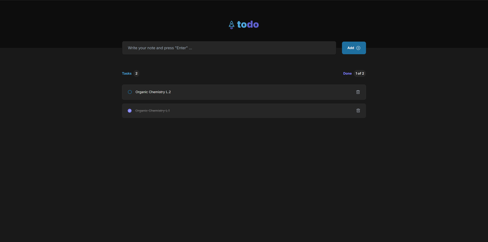
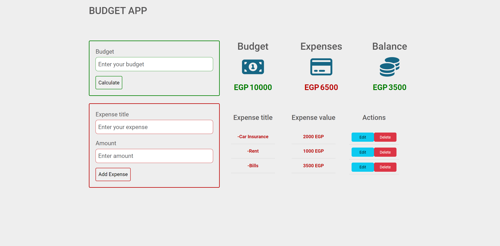

# Productivity Tools 🚀

Welcome to the **Productivity Tools** repository! 🎉 This collection features web applications designed to boost productivity through efficient task management, time tracking, and budgeting. Explore these projects to enhance your workflow and stay organized.

## Overview 📚

This repository includes a variety of productivity tools, each crafted to improve efficiency and organization. From task management apps to budgeting tools, these projects are built with modern technologies to provide smooth and effective solutions.

## Projects 🚀

### [Todo React](https://github.com/ahmedkamal14/Todo-React) ✅
A task management application built with **Vite**, **React**, and **Tailwind CSS**. It features a clean UI for managing tasks with add, edit, and delete functionalities.

- **[Live Preview](https://ahmedkamal14.github.io/Todo-React/)**
- **[Repository](https://github.com/ahmedkamal14/Todo-React)**

---

### [ID Info](https://github.com/ahmedkamal14/ID-Info) 🆔
A tool designed to retrieve personal information from an Egyptian national ID number. Built with **Vite**, **React**, and **Tailwind CSS**, it provides a simple and effective interface for accessing ID details.

- **[Live Preview](https://ahmedkamal14.github.io/ID-Info/)**
- **[Repository](https://github.com/ahmedkamal14/ID-Info)**

---

### [Budget App](https://github.com/ahmedkamal14/Budget-App) 💵
A budgeting tool created with **HTML**, **CSS**, and **JavaScript**. It helps track expenses and manage budgets with a straightforward and responsive design.

- **[Live Preview](https://ahmedkamal14.github.io/Budget-App/)**
- **[Repository](https://github.com/ahmedkamal14/Budget-App)**

---

## Technologies Used 💻

Here’s a list of technologies used in these projects:

- **Vite** 
- **React** 
- **Tailwind CSS** 
- **HTML** 
- **CSS** 
- **JavaScript** 

## Getting Started 🏁

To explore any of the projects, click on the **Live Preview** links to see them in action or visit the **Repository** links to dive into the code.

## License 📜

This project is licensed under the [MIT License](https://opensource.org/licenses/MIT). See the [LICENSE](LICENSE) file for details.
